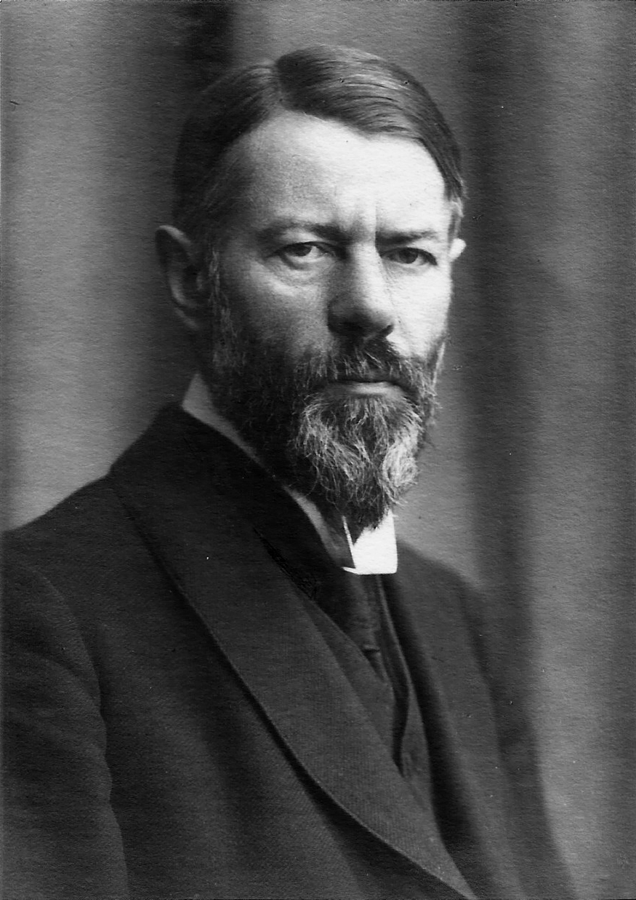

## Housekeeping

- Troubleshooting audio problems
  - Check your speaker/headset is plugged in / volume is on.
  - Click on audio in Zoom to change to listening via phone

- Accessing the data & course material
  - Make sure that you have signed the license agreement
  - Links to the course material will be shared in the chat
  - Data -> Download link (expires today!)
  - Practical workbook -> GitHub

## Plan of the course 

- Day 1

  - Origins  of time use research
  - Structure and design of time diary data
  - Introduction to the Multinational Time Use Study
  - Computing simple time use estimates

- Day 2

  - Computing tempograms
  - Data quality and weighting
  - Working with work schedules
  - Research example

## 

{fig-align="left" fig-alt="A drawing representating the fluidity and the difficulty of capturing time"} 
 

# 1. Origins of time use research

## What is time? 

Time as implicit knowledge (Adam 1996)

-  *Contextual time or timescapes* 	
  
   -  Natural time (ie seasons, planetary cycles)
   -  Has a direction, which is irreversible (ie birth, ageing and death)
   -  Plural experiences (between people, other beings, etc...)

-  *Delimited time*

   -  can be *measured*  and  *divided*  (by clock  and calendars); 
   -  universal and invariable rhythms (ie days, months are the same everywhere); 
   -  that is a limited and commodified resource: valuing speed

 
## Growing interest for measured time 

-  Early 20th Century: 

   - Surveys of peasant households in pre-1917 Russia  
   - Time use of working class women in London 1909-13 by the Fabians 
   - Time budget of Soviet workers and peasants in 1923–1924; 
   - USDA  large-scale time-diary studies of American households:
   
     - 1924-28 Farm and small towns households
     - 1930-31 College educated  women

-  In the UK (1930s onwards): 

   - Mass Observation  
   - BBC [listener surveys](https://britishonlinearchives.com/collections/16/bbc-listener-research-department-reports-1937-c1950) (1937-)

## More recently 

-  Alexander Szalai's *The Use of Time* (1972)

 	 -  Pioneering survey of urban households in 12 countries
	 -  First systematic recording of '*who does what, where, with whom*'over 24h

- Large scale nationally representative surveys

  - American Time Use Study; Indian Time Use Survey, UK, etc..

- Harmonisation efforts: 

  - Multinational Time Use Study (MTUS)
  - Harmonised European Time Use Surveys (HETUS) from 1998; 
  - International Classification of Activities for Time Use Statistics (ICATUS-2005)

## In the UK

  - 2000; 2014/15 UK Time Use Survey
  - 2020-25 [Online Time Use Study](https://datacatalogue.ukdataservice.ac.uk/studies/study/9552)

  - Time diaries in existing large scale studies:
    - [Millennium Cohort Study Sweeps 6 & 14](https://cls.ucl.ac.uk/wp-content/uploads/2019/05/MCS-Age14-time-use-diary-user-guide.pdf)
    - [Understanding Society Innovation Panel Wave 7](https://www.understandingsociety.ac.uk/documentation/innovation-panel/user-guide/innovation-panel-user-guide/experiments/non-experimental-experiment-studies/associated-study-time-use-diary/)

Also:

- [CTUR 6 Wave Sequence across the COVID-19 Pandemic, 2016-2021](https://datacatalogue.ukdataservice.ac.uk/studies/study/8741#details
)

- [CTUR UK Time Use Survey, March 2023](https://datacatalogue.ukdataservice.ac.uk/studies/study/9336#details)

## What drives this interest for time use? 

:::: {.columns}
::: {.column width="60%"}
-  Push to monitoring  (household) productivity
-  Finer understanding of labour force behaviour
-  Social (central) planning
-  Better understanding of consumer behaviour
-  Investigate social issues ie poverty, gender inequality
-  More broadly part of the trend towards continued rationalisation of societies (Weber) 
:::
::: {.column width="40%"}
{width="60%" fig-align="left"  fig-alt="A photograph of Max Weber in 1918"}
:::
:::: 

<!-- ## What does  time use surveys look like?  -->

<!-- -  Example: [2015 UK Time Use Survey](https://datacatalogue.ukdataservice.ac.uk/studies/study/8128#details) -->

<!-- 	 -  16,550 diary days of 10,208 respondents in 4,238 households -->

<!-- 		 -  Diaries for respondents aged 8 and above  -->

<!-- 	 -  Collected all year round -->

<!-- 	 -  Individual survey questions ie -->

<!-- 		 -  How old are you?  What is your job? -->

<!-- 	 -  Time diary  -->

<!-- 		 -  10 minutes time slots -->
<!-- 		 -  2 days per person (1 weekday/1 day at the weekend) -->
<!-- 		 -  Unit of observation is *a day*  rather than a person -->

				

## What is recorded in time diaries ?
	
 -  *Main*  activity \small ie 'eating dinner '\normalsize
 -  *Secondary*  activity \small ie 'watching Instagram'\normalsize
	
 -  Location of the activity \small (ie at home, at work, etc)\normalsize
 -  Who was also present 

 -  Any unique combination of the above is an *episode* 
 -  Recent features:
 
	 -  Whether a device (ie phone...) was used
	 -  Immediate wellbeing: enjoyment

  -  Activities recoded using a harmonised nomenclature
		
		
	
 
## A paper time diary example 
	
{fig-align="left" fig-alt="A screenshot of the paper diary from the 2014-15 UK Tome Use Survey" } 
	

## Common estimates from time diaries 

-  The time spent on activities ie their duration
-  Their scheduling and sequencing through the day
-  The probability of activities to be  taking place  or not  
-  The importance (in terms of duration, probability of occurrence) of some activities relative to other ones
-  Change over time in the above

		
 
## Durations of activities  
			
{fig-align="left" fig-alt="A plot representing the average daily time spent in various activities in the UK 1961-2015"}
			

## Duration of activities? 

-  For simplicity, activities were grouped in 4 categories
-  For each time point, we have the average amount of time spent on each activity
-  Activities all add up to 24h ie 1,440 minutes.
-  We can compare time use between groups 
-  Three main lessons
-  Overall impression of stability over time

   -  Little change in sleep and leisure duration
   -  Opposite trends in paid and unpaid work
   -  Marked gender differences 
	
	
 
## Scheduling of activities 

-  The following plots show by time of the day, the percentages of people engaged across 8 types of activities
-  We can follow the daily rhythms of people
	
   -  Paid work leisure, meal times
   -  Partial blurring of originally heavily gendered use of time 
   -  Changes in leisure behaviour
   -  Spread of eating time: erosion of the traditional meal
	
 
## 

:::: {style="font-size: 0.5em"}

::: {layout-ncol=2}

{fig-align="left" fig-alt="Tempogram of daily activities, women, 1961" }

{fig-align="left" fig-alt="Tempogram of daily activities, men, 1961" }

Source Gershuny et al 2020

:::
::::

 
## 
:::: {style="font-size: 0.5em"}

::: {layout-ncol=2}

{fig-align="left" fig-alt="Tempogram of daily activities, women, 2015" }

{fig-align="left" fig-alt="Tempogram of daily activities, men, 2015" }

(Source: Gershuny et al 2020)
:::
:::: 

## Summary 
 
-  Over the course of the 20th century, rise of interest for the way men, women and households spend their time 
<!-- -  Systematic time diary data collection from the 1960s -->
-  There is now large amount of comparative data enabling time use research 
-  Time diaries record primary, secondary activities and their context
-  Stability *and*  change in daily behaviour over the last 50 years; gender contrasts

	
# 2. Overview of time diary data

## Some basic vocabulary

- **Activity** Action recorded by respondents in the time diary ie what the respondent was doing during an episode

	- Example: I am teaching time diary analysis
	- Multitasking: Primary vs secondary

- **Episode** Any unique combination of primary, secondary activity, copresence and location

	- Episode 1. I watch TV whilst eating crisps alone at home; 
	- Episode 2. I watch TV whilst eating crisps with my son at home	
	- Episode 3. I play video games whilst eating crisps with my son at home
	
- **Time slot**  Minimum duration of an episode (ie resolution of the time diary). Usually 10 or 15 mins

## Data structure of time use surveys

{fig-align="left" fig-alt="A drawing representing the structure of time-diary household surveys"}

## Data structure  and files 

1. Individual files ie person-level data

	- Socio-demographic characteristics ie age, education...

2. Day-level files (aka 'aggregate' files)

	- Each line in the dataset records a day
	- Often, 2 or more lines per respondent
	- Aggregate variables (ie time spent on activities)
	
	- Also sometimes include day level variables: *Is this a rushed day?*
	- May also include time diary data in wide format

##  Episode data

- Each line in the dataset records an *episode*
- On average 15 episodes per day per person
- Episodes are embedded within days within persons
- One of the most common time diary format
- Intuitive, but requires more storage space and computing power than wide format
- Requires episode number, duration, start and end time

|		Ep nr 	 |Person nr	|Day nr	|Duration	|Activity		|Start|End|
|------------|----------|-------|---------|-----------|-----|---|
|		1  				|1				|1			|360				|Sleep			|10			|370|
|		2  				|1				|1			|20				|Shower	 |370		|390|
|		3  				|1				|1			|30				|Breakfast	 |390		|420|

## Slot-level data 

- Each line records a 10 minute time slot of the diary 
- 144 observations (ie lines) per day per respondent
- Requires a slot ID variables
	
|	Slot nr|Person nr	|Day nr	|Activity|				
|--------|----------|-------|--------|
|	1 			|1				|1			|Sleep|			
|...			|...			|...    |...|
|	42  		|1				|1			|Shower|
|	43  		|1				|1			|Shower|
|	44  		|1				|1			|Breakfast|	 
|	... 		|...			|...    |...|
|	144 		|1				|1			|Sleep| 
			
- In many time use surveys, days begin at 4 AM and end at  3.59 AM

## Data structure  in wide format
	
- Episode and time slots  datasets are also available in wide format.
- Example of a time slots dataset in the wide format:

|Day|Pers. |Activity -- TS 1|...|Act. -- TS 42|...|Act. -- TS 144	
|----|-----|----------------|---|-------------|---|--------------|
|1  |1|Sleep|...   |Sleep|...|Watch TV			
|2  |1				|Sleep|...	|Commute|...|Sleep
|1  |2				|Sleep|...|Shower|...|Sleep
	

- Lines$=$days, variables records activity, location, copresence for one time slot  
- Lots of variable, less intuitive but also less resource-intensive than the long format
- During this course, we will be working with episode files in the long format

## Recap: variables in time diary dataset

- Primary and secondary activities
- If episode files: duration
- Incremental time in minutes / clock time
- Copresence, ie 'with who were you?'
- Location
- Day of the week, month, calendar date
- Diary number (ie whether this diary was the first one collected)

- Less common variables

	 - Whether feels rushed on the day
	 - Whether  day is a typical day
	 - Enjoyment
	 - Device use
	 - Work schedule
					

## Nomenclatures of activities

- Until recently  activities were  written down literally in time diaries  (ie *I walked the dog around the block*) and needed to be recoded
- Indispensable to standardise activities
- National and international norms and guidelines for coding activities
- Three main international nomenclatures: MTUS, HETUS. ICATUS (UN-based)
- National nomenclatures: US (ie ATUS), Japanese, Korean, Indian Time Use surveys have their own

## Harmonised European Time-use survey nomenclature	

{fig-align="center" fig-alt="Screenshot from the HETUS nomenclature of activities"}

## Indian Time Use Survey nomenclature	

{fig-align="center" fig-alt="Screenshot from the Indian Time Use Nomenclature of activities"}

## American Time Use Survey nomenclature	

{fig-align="center" fig-alt="Screenshot from the American Time Use Nomenclature of activities"}

<!-- ## MTUS nomenclature	 -->

<!-- {fig-align="center"} -->

## Workflow: producing time use estimates from time diaries

- One can:
	- ... work directly with aggregate variables in day-level datasets ('Aggregate files' in MTUS jargon)
	- ... compute one's own, which usually entails four steps:

		1. Recoding original time use activities in the episode dataset 
		2. Sum the total  time spent on these activities within day & person
		3. Merge the data with person-level variables of interest
		4. Produce the estimate of interest (ie, mean, median, etc)

## References

Adam, B. (1995). Timewatch: The Social Analysis of Time. Polity Press.

Baster, N. (1958). Some Early Family Budget Studies of Russian Workers. American Slavic and East European Review

Gershuny, J., & Sullivan, O. (2020). What We Really Do All Day: Insights from the Centre for Time Use Research. Penguin UK.

Pember Reeves, M. (1913). Round About a Pound a Week. Fabian Society

Szalai, A. (ed.) (1972). The Use of Time: Daily Activities of Urban and Suburban Populations in Twelve Countries. The Hague, Paris: Mouton.

## Resources 
- [UK Time Use Survey at UKDS](https://datacatalogue.ukdataservice.ac.uk/series/series/2000054#abstract)

- [UK Time Use Survey at the Office for National Statistics](https://www.ons.gov.uk/peoplepopulationandcommunity/personalandhouseholdfinances/incomeandwealth/datasets/timeuseintheuk)

- [American Time Use Survey](https://www.bls.gov/tus/)

- [Indian Time Use Survey](https://microdata.gov.in/NADA/index.php/catalog/236/data-dictionary/F2)

- [Harmonised European Time Use Surveys (HETUS)](https://ec.europa.eu/eurostat/web/time-use-surveys)

- [International Classification of Activities for Time-Use Statistics 2016 - ICATUS](https://unstats.un.org/unsd/classifications/Family/Detail/2083) 

- [Multinational Time Use Study](https://www.timeuse.org/mtus)