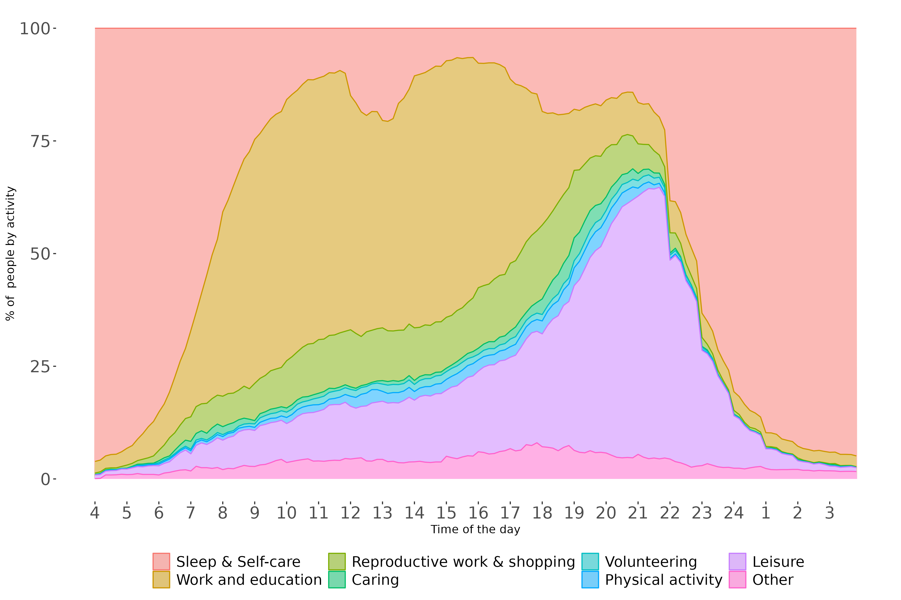
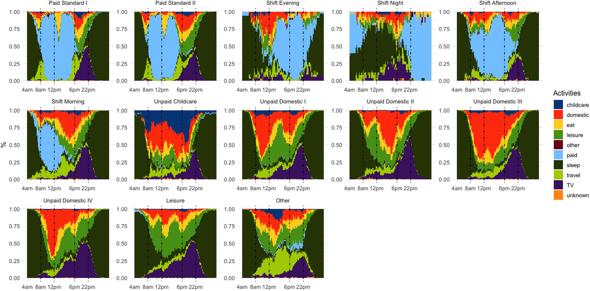

## 
  
{fig-align="left" fig-alt="A drawing representating the fluidity and the difficulty of capturing time"}

## Day 2

- Objectives
  - Compute duration estimates
  - Understand potential time diary quality issues 
  - Understand and deploy diary weights for inference
  - Understand and compute tempograms
- Presentations + code demonstrations
- Plan
  - Recap from Day 1
  - Another illustration: mode of travel
  - Weighting and data quality
  - Research example: the context of activities - Killian Mullan (Aston University) 
  - Tempograms

# Recaps

## Essentials of time diary survey data

- Time use data typically consists of:
  - Individual/aggregate file
  - Diary file
      - Most of the time consists of episodes 
      - Combination of activities (primary/secondary), copresence, location
      - Sometimes day-level variables (Typical day?)
      - Variables: start & end time, duration, content + the above
      - Less commonly: time slots

- Data structure:
  - Episodes/time slots < Days < People < Households
  - Diaries can be in Long (lines= episodes) vs wide format (lines=days)

##  Deriving  estimates from  diary data

- Typical estimates:
   - Duration or probability of participation in (groups of) activities
   - Duration: full sample vs participants only 

- One can:
	- ... work with ready made aggregate variables (day-level, durations) 
	- ... compute one's own, which usually entails four steps:

		1. Recode original time use activities in the episode dataset 
		2. Sum the total time spent on these activities within day & person
		3. Merge the data with person-level variables of interest
		4. Compute the estimate of interest (ie, mean, median, etc)

# Statistical inference with time use surveys

## Statistical inference in a nutshell...
 
- We want to estimate a quantity from a population using a representative sample. 
- Random sampling produce such samples, but present  some degree of bias:
	- Some socio-demographic groups have lower/higher  probabilities of being sampled
	- ... and/or are less likely to take part 
- Sampling techniques such as *stratification* and *clustering* are meant  to  deal with these:
  - Recruiting  more respondents from  under represented groups  (ie by gender, age, ethnicity...)
  - While keeping costs down (excluding some areas from the population)
- In order to tackle sample bias, estimation should include :
  - Weights --> point estimates
  - Survey design variables (ie PSUs and strata) --> Adjusted confidence intervals/standard errors
  - ... Not always possible to access SD variables
 
 

## ... and from time use surveys
 
-  Nature of the  population: 
    - *Days* of individuals within a geographical are during the period sampled 
	  - UK TUS 2014: days of UK households in 2014-15
	  - Goal: equal probability of selection of day, months
	  - Diary days are randomly allocated, but... 
	    - ... People don't always do as  told --> unequal distribution of days
	  - *Diary weights* are needed to compensate for this
	 
	
-  Diary weights= survey weights * day/month non-response weights
-  Limits to inference from time-diary data:
    - Period covered by fieldwork (not all TUS cover a full year)
    - Limited within person variation (only 2 days of data per person!)
      - Difficult to estimate the individual propensity of engaging in marginal activities 

## Other data quality issues in TUS
	 
-  Number and diversity of episodes 
		 
	- 15 per day on average; 
	- fewer than 7->bad quality (MTUS)
	- ... and missing key activities (ie meals, sleeping)
	 
-  Missing episodes, incoherent diary
-  Gap in the diary, missing beginning or end of day, extra episode
  
  -  Data checks and imputation 
 
	 -  Count the number of episodes(within-day)
	 -  Total durations needs to add up to 1440 min
	 -  Start time of the $n^{th}$ episode  has to be identical to the end time of episode $n^{th-1}$
	 -  Common sense, case by case  imputation  of episodes
	
 
# Visualising activities throughout the day: tempograms

## Tempograms
 
-  Episodes and activities may be described with other tools than duration/probability of occurrence
-  We may want to observe the distribution of activities throughout the day:
    -  Proportion of people engaged in  activities by time of the day
    -  What are people doing on average at 10 o'clock on a typical day?
-  ... Or  their sequencing ie scheduling and ordering
  	-  *Tempograms* are a way to represent the scheduling...
  	-  ... and sequencing (sort of)  of activities
	 	

## What do men do on weekdays?

## Creating tempograms
	 
-  Tempograms are computed from time slot data, either in long or wide format
		
	-  X axis: 24 hours  split into 144 time slots
	-  Y axis: the proportions of people engaged in each class of activities
	-  Steps to create a tempogram:

		1.  Recode activities  in groups
		2.  Compute, for each time slot, the proportion of respondents in each (group of) activities
		3.  Plot it using area plot (in *ggplot2*)
		4.  Let's do this by gender and day of the week!

	 	
	
	
## Men - weekdays and weekend

::: {layout-ncol=2}

:::

## Women - weekdays and weekend

::: {layout-ncol=2}

:::

		

# Work schedules

## Understanding working hours 

-  Work schedules are a special type of time diaries,  collected in a few time-use surveys
-  Part of HETUS guidances until 2018
-  Records paid work and full-time education (only) over a full week - seven days
-  Collected in the 2000 and 2014/15 UK TUS
-  Marginally coarser resolution than traditional time diaries: ie 15 minutes slots
-  Full  mapping of the actual working week
-  More robust capture of atypical working hours than stylised questions
	 

## Work schedule diary (UKTUS 2014/15)

	

## Work schedule diary (UKTUS 2014/15)

	

## Work schedule tempogram

	

# Further topics

## Regression
	 
		
-  Simplest case: linear model of activity duration $t_{di}$...
-  Logistic model of the probability of engaging in an activity on a given day: ie $P(t_{di>0}$)

	- A few things to keep in mind...
		 
		-  Different activities may have different distributions
		-  Zeroes need to be dealt with: separately  or via selection models
		-  Clustering of observations: robust standard errors; fixed effects/ models
		 
- In *R*, `lm()` or `glm()` from the *stats* package. 
- Functions for robust standard errors estimation: ie *sandwich* *estimatr* packages
	 
	

## Sequence analysis
 
-  Focus on *sequences* of (a limited number of) activities or episodes
-  Group them into clusters (via cluster analysis) based on their *distance*
-  Perform further analyses (ie probability of being in a given cluster rather than another) on the outcome
-  See Lesnard and Kan(2011) and Vagni (2020) for  examples focusing on paid work
-  See R package [TraMineR](https://traminer.unige.ch) (Gabadinho et al 2011) 
 
## Sequence visualisation

{fig-alt="A plot from Vagni 2020 representing typical tempograms by clusters of activities"}

## References

 Blair G, Cooper J, Coppock A, Humphreys M, Sonnet L (2025). _estimatr: Fast Estimators for Design-Based Inference_.
  [doi:10.32614/CRAN.package.estimatr](https://doi.org/10.32614/CRAN.package.estimatr)

Gabadinho A, Ritschard G, Müller N, Studer M (2011). “Analyzing and Visualizing State Sequences in R with TraMineR.” Journal of Statistical Software, 40(4), 1–37. [doi:10.18637/jss.v040.i04](https://doi.org/10.18637/jss.v040.i04)

Lesnard, L. and Kan, M.Y. (2011), Investigating scheduling of work: a two-stage optimal matching analysis of workdays and workweeks. Journal of the Royal Statistical Society: Series A (Statistics in Society), 174: 349-368. [doi:10.1111/j.1467-985X.2010.00670.x](https://doi.org/10.1111/j.1467-985X.2010.00670.x)

Vagni G. The social stratification of time use patterns. Br J Sociol. 2020;71:658–679, [doi: 10.1111/1468-4446.12759](https://doi.org/10.1111/1468-4446.12759)

Zeileis A, Köll S, Graham N (2020). “Various Versatile Variances: An Object-Oriented Implementation of Clustered Covariances in R.” Journal of Statistical Software, 95(1), 1–36. [doi:10.18637/jss.v095.i01](https://doi.org/10.18637/jss.v095.i01)

## Resources

- Time Use in Canada: [Interactive visualization tool at Statistics
Canada](https://www150.statcan.gc.ca/n1/pub/71-607-x/71-607-x2025002-eng.htm)

- Nathan Yau [Who we choose to spend our days with](https://flowingdata.com/2025/12/17/time-with-others/) (data from ATUS)
- Kamila Kolpashnikova's time use data [visualisation tools on GitHub](https://github.com/Kolpashnikova/Kolpashnikova) 
- [Multination Time Use Study User Manual](https://www.timeuse.org/MTUS-User-Guide)